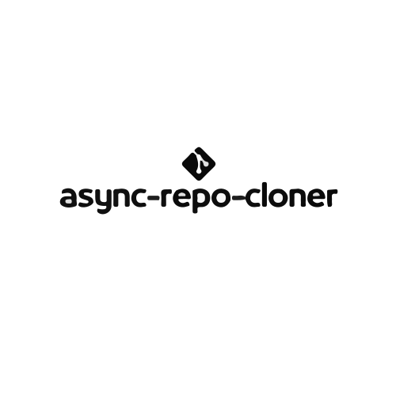
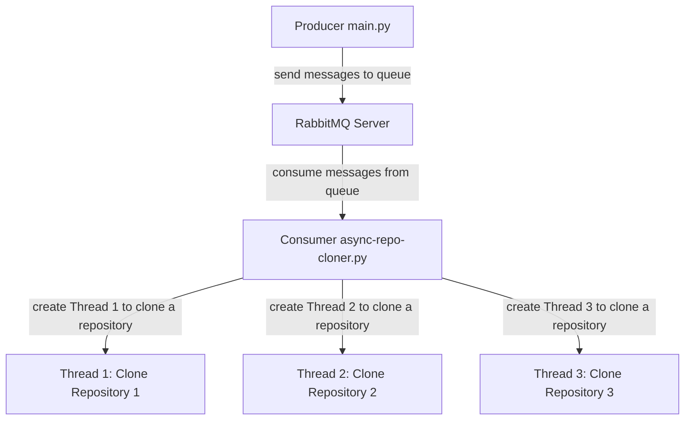

<p align="center">
   
</p>

<p align="center">	
   <a href="https://www.linkedin.com/in/gustavo-gk/">
      
   </a>
  
  
  <a href="mailto:gust.krv@gmail.com">
   
  </a>
</p>

<div align="center">
  <sub> Made with 💖 by
    <a href="https://github.com/gustavogk"> Gustavo Assunção.
    <h1></h1>
  </sub>
</div>
  
# async-repo-cloner
O "async-repo-cloner" é um componente que gerencia a clonagem assíncrona de vários repositórios do GitHub, visando a recuperação de informações e dados históricos para análise. Ele funciona através de um esquema de produtor/consumidor, onde o produtor solicita a clonagem dos repositórios e enfileira os pedidos em um servidor de mensageria (RabbitMQ). Os clientes (consumidores) pegam um pedido da fila e executam a clonagem do repositório utilizando threads em python, permitindo a clonagem simultânea de múltiplos repositórios sem sobrecarregar o sistema.

# 📌 Contents

* [System Diagram](#system-diagram) 
* [Technologies](#rocket-technologies) 
* [How to Run](#computer-how-to-run)
* [Issues](#bug-issues)
* [Contributing](#sparkles-issues)
* [License](#page_facing_up-license)
  
# ⚙️ System Diagram
  

    
# :rocket: Technologies
This project was made using the follow technologies:

* [Python](https://www.python.org/)      
* [RabbitMQ](https://www.rabbitmq.com/)      
* [GitPython](https://gitpython.readthedocs.io/en/stable/)
* [Docker](https://docs.docker.com)

# :computer: How to run
  
```bash
# Clone Repository
$ git clone https://github.com/gustavogk/async-repo-cloner
```

```bash
# Create virtual environment
$ python3 -m venv nome-do-ambiente

# Access the virtual environment
$ .\nome-do-ambiente\Scripts\activate

# Install Dependencies
$ pip install -r requirements.txt

# Run Aplication
$ python3 .\async-repo-cloner.py
```
  
```bash
 # Run RabbitMQ with docker, just run the following command line:
 $ docker run --rm -p 5672:5672 -p 8080:15672 rabbitmq:3-management
```
  
```bash
 # Test send repositories to be cloned through the main.py script
 $ python3 .\main.py
```

# :bug: Issues

Create a <a href="https://github.com/gustavogk/async-repo-cloner/issues">new issue report</a>, it will be an honor to be able to help you solve and further improve our application.

# :sparkles: Contributing

- Fork this repository;
- Create a branch with your feature: `git checkout -b my-feature`;
- Commit your changes: `git commit -m 'feat: My new feature'`;
- Push to your branch: `git push origin my-feature`.

# :page_facing_up: License

This project is under the [BSD 2-Clause License](./LICENSE).
Made with 💖 by [Gustavo Assunção](https://www.linkedin.com/in/gustavo-gk/). 

Thank you! 🌠
